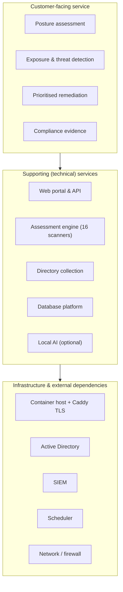
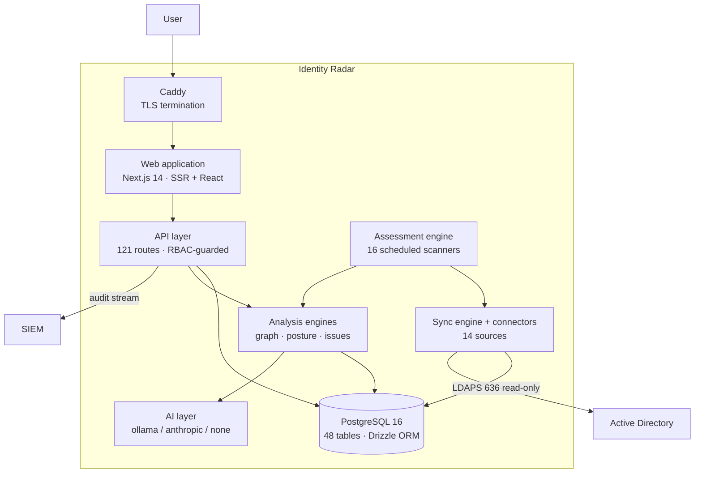
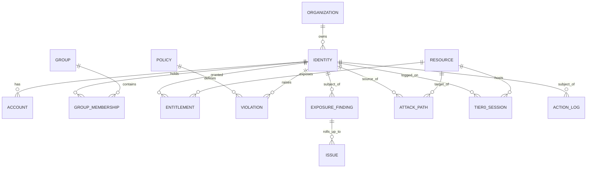
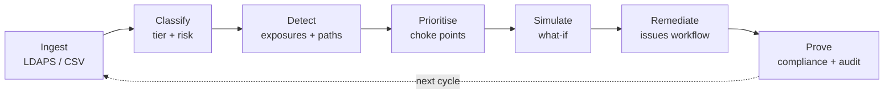
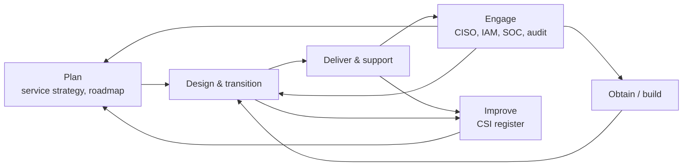
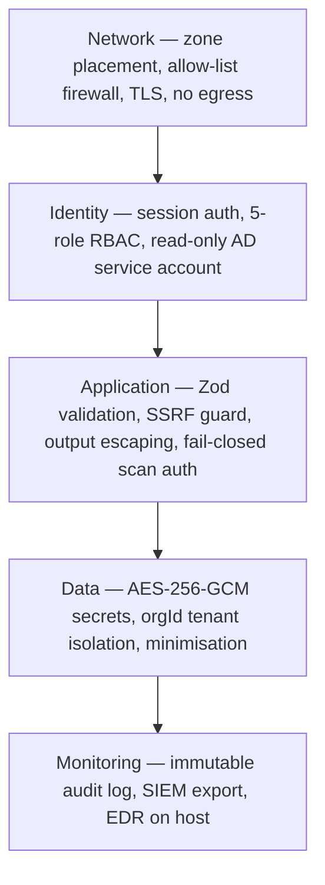
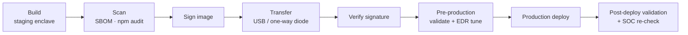
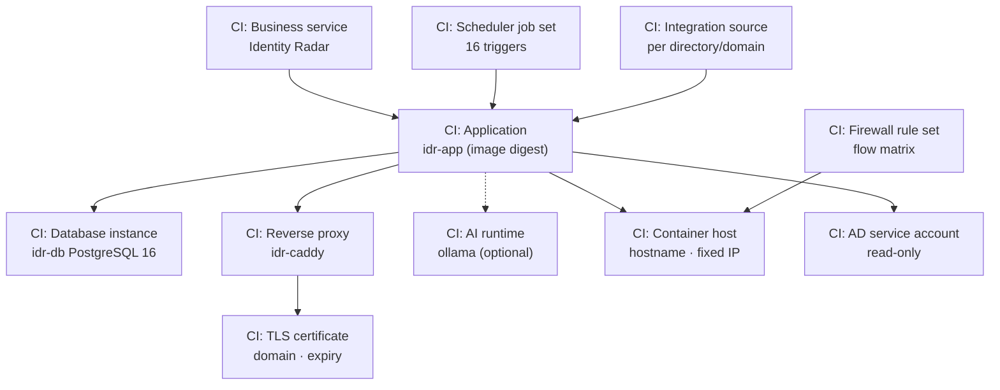
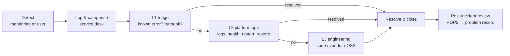

# Identity Radar — Service Architecture (ITIL 4 aligned)

> Identity Radar described as an **IT service**, not just a system: service definition,
> the four dimensions, the service value chain, and the ITIL practices needed to design,
> transition, operate and improve it in an enterprise.
>
> Companions: [Solution Architecture](./solution-architecture.md) (network placement,
> topologies, firewall matrix) · [Hardened environment](../deployment/hardened-environment.md)
> (EDR/XDR coexistence) · [SOC change record](../deployment/soc-change-record-template.md).
>
> Service baseline (verified 2026-07-15): 48 database tables · 121 API routes · 36 pages
> (17 in MVP navigation) · 16 scheduled scanners · 14 connectors · 199 automated tests ·
> 836 i18n keys per locale (EN/AR).

---

## 0. Practice coverage map

| ITIL 4 practice | Where covered | Status |
|---|---|---|
| Service catalogue management | [§1](#1-service-definition--catalogue) | Defined |
| Organizational change management / Workforce | [§2.1](#21-dimension-1--organizations--people) | Defined |
| Architecture management | [§2.2](#22-dimension-2--information--technology) | Defined |
| Supplier management | [§2.3](#23-dimension-3--partners--suppliers) | Defined |
| Business analysis / Value streams | [§2.4](#24-dimension-4--value-streams--processes), [§3](#3-service-value-chain) | Defined |
| Service level management | [§4.1](#41-service-level-management) | Targets set, needs customer sign-off |
| Availability management | [§4.2](#42-availability-management) | Defined |
| Capacity & performance management | [§4.3](#43-capacity--performance-management) | Defined |
| Service continuity management | [§4.4](#44-service-continuity-management) | Defined |
| Information security management | [§4.5](#45-information-security-management) | Implemented |
| Change enablement | [§5.1](#51-change-enablement) | Defined |
| Release & deployment management | [§5.2](#52-release--deployment-management) | Implemented |
| Service validation & testing | [§5.3](#53-service-validation--testing) | Implemented (199 tests) |
| Service configuration management (CMDB) | [§5.4](#54-service-configuration-management-cmdb) | Defined |
| Knowledge management | [§5.5](#55-knowledge-management) | Partial — runbooks pending |
| Monitoring & event management | [§6.1](#61-monitoring--event-management) | Implemented |
| Incident management | [§6.2](#62-incident-management) | Defined |
| Problem management | [§6.3](#63-problem-management) | Defined |
| Service request management | [§6.4](#64-service-request-management) | Defined |
| Service desk | [§6.5](#65-service-desk) | Defined |
| Access management | [§6.6](#66-access-management) | Implemented |
| IT asset management | [§5.4](#54-service-configuration-management-cmdb) | Defined |
| Continual improvement | [§7](#7-continual-improvement) | CSI register open |
| Risk management | [§8](#8-risk-register) | Register open |
| Deployment / Infrastructure & platform management | [§5.2](#52-release--deployment-management), [§2.2](#22-dimension-2--information--technology) | Implemented |
| Software development & management | [§5.3](#53-service-validation--testing) | Implemented |

---

## 1. Service definition & catalogue

### 1.1 Business service entry

| Attribute | Value |
|---|---|
| **Service name** | Identity Security Posture & Threat Response (Identity Radar) |
| **Service type** | Business-enabling security service (internal, customer-facing to security & IAM functions) |
| **Service owner** | Head of Identity & Access Management |
| **Technical owner** | Security Platform Operations |
| **Business outcome** | Reduce the risk of privilege escalation to Tier 0 (domain takeover) and evidence identity control effectiveness to regulators |
| **Users** | CISO, IAM engineers, security analysts, internal audit, DPO |
| **Criticality** | Tier 2 business service; the platform host is treated as a **Tier 0-adjacent asset** because it holds a directory service account |
| **Service hours** | Portal 24×7; assessment jobs continuous; support per §4.1 |
| **Dependencies** | Active Directory, network/firewall, SIEM, scheduler, (optional) local AI host |
| **Data classes handled** | Secret, confidential-personal, confidential-security, audit (see §2.2.4) |

### 1.2 Service offerings

| Offering | Description | Consumer | Delivery |
|---|---|---|---|
| **Posture assessment** | Identity inventory, tiering compliance, risk scoring | IAM engineer | Self-service portal + scheduled scans |
| **Exposure & threat detection** | AD exposures grouped by attack impact; attack paths; live Tier 0 access | Security analyst | Portal + SIEM events |
| **Prioritised remediation** | Choke-point fix list, what-if simulation, issues workflow with scripts | IAM engineer (CISO approves) | Portal, request-driven |
| **Compliance evidence** | NCA ECC / SAMA CSF / PDPL control scoring and exports | Audit, CISO | Portal + exported report |
| **Directory onboarding** | Connect a new domain/source (LDAPS or CSV) | IAM engineer | Service request (§6.4) |

### 1.3 Service model — what the user consumes vs. what supports it

---

## 2. The four dimensions of service management

### 2.1 Dimension 1 — Organizations & people

**Service roles and RACI**

| Activity | Service owner | Platform ops | IAM engineer | Security analyst | SOC | CISO |
|---|:--:|:--:|:--:|:--:|:--:|:--:|
| Define service levels | **A** | C | C | C | I | R |
| Deploy / upgrade platform | A | **R** | C | I | I | I |
| Onboard a directory source | A | C | **R** | I | I | I |
| Tune scan cadence | A | R | C | C | **C** | I |
| Triage exposures / issues | A | I | C | **R** | I | I |
| Approve remediation & exceptions | A | I | R | C | I | **R/A** |
| Execute remediation in AD | A | I | **R** | I | I | A |
| Allow-list detections for the platform | A | C | I | C | **R** | I |
| Incident response for the service | A | **R** | C | C | C | I |
| Compliance reporting | **R** | I | C | C | I | **A** |

*(R = responsible, A = accountable, C = consulted, I = informed)*

**Competency requirements**

| Role | Required skills |
|---|---|
| Platform ops | Linux, Docker/Kubernetes, PostgreSQL, TLS/PKI, backup & restore |
| IAM engineer | Active Directory, tiered admin model, delegation/ACLs, PowerShell |
| Security analyst | Attack-path reasoning, Kerberos attacks (Kerberoast/AS-REP/delegation), MITRE ATT&CK |
| SOC | EDR/XDR tuning, detection allow-listing, SIEM correlation |

### 2.2 Dimension 2 — Information & technology

#### 2.2.1 Application architecture (C4 Level 2 — containers)

| Container | Technology | Responsibility |
|---|---|---|
| Caddy | Caddy 2 | TLS, reverse proxy, automatic HTTPS |
| Web application | Next.js 14, React, Tailwind 4, next-intl | UI, SSR, EN/AR RTL |
| API layer | Route handlers, Zod, NextAuth v5 | AuthN/Z, validation, CRUD, audit writes |
| Assessment engine | Route handlers + external scheduler | Periodic posture/threat assessment |
| Sync engine & connectors | TypeScript, ldapjs | Ingest and normalise directory data |
| Analysis engines | TypeScript (BFS/DFS, greedy set-cover) | Attack paths, choke points, what-if, exposures |
| AI layer | Ollama / Anthropic / none | Narration, triage, reporting — **never writes to the database** |
| PostgreSQL | PostgreSQL 16 | System of record |

#### 2.2.2 Technology stack

| Layer | Technology | Notes |
|---|---|---|
| Presentation | Next.js 14 App Router, React, Tailwind CSS 4 | SSR default; client components only where interactive |
| Typography & i18n | Self-hosted IBM Plex (Sans/Mono/Arabic), next-intl | Air-gapped fonts; EN/AR parity enforced |
| Visualisation | Recharts, D3 force graph | Shared token-driven chart theme |
| Runtime | Node.js 20 LTS, TypeScript | `output: standalone` |
| AuthN/Z | NextAuth v5, bcrypt(12), custom RBAC | JWT sessions |
| Validation | Zod 4 | Every boundary |
| Data access | Drizzle ORM 0.45 | Typed, parameterised |
| Database | PostgreSQL 16 | 48 tables |
| AI | Ollama (`qwen2.5`) / Anthropic / none | Local-first, optional |
| Platform | Docker Compose (reference) or Kubernetes | Non-root containers |
| Quality | Vitest, Playwright | 199 tests |

#### 2.2.3 Information model — identity-first

One `identities` table serves human and non-human identities (`type` =
`human | non_human`, sub-types `employee`, `contractor`, `service_account`,
`managed_identity`, …). Every other domain object references it.

#### 2.2.4 Information classification, residency & retention

| Class | Examples | Handling | Retention |
|---|---|---|---|
| **Secret** | AD service-account password, API keys, webhook secrets | AES-256-GCM at rest; never logged or returned by APIs | Until rotated |
| **Confidential — personal** | Display name, UPN, email, department, manager | PDPL scope; minimised to posture-relevant attributes; RBAC-gated | While present in source |
| **Confidential — security** | Exposures, attack paths, tier violations, live sessions | Analyst+ roles | Current + snapshot history |
| **Internal** | Aggregate scores, trends, compliance scores | `viewer` and above | Long-lived (trend) |
| **Audit** | `action_log` | Append-only; never truncated by the application | Per audit policy + SIEM copy |

**Residency:** all data remains on-premises. In the default air-gapped deployment there is
**no cross-border transfer** — the PDPL-critical property. Cloud AI (`ANTHROPIC_API_KEY`)
is the only path that would send data off-box and is left unset for sovereign deployments.

### 2.3 Dimension 3 — Partners & suppliers

| Supplier / dependency | Provides | Type | Risk if unavailable | Management |
|---|---|---|---|---|
| Active Directory team (internal) | Read-only service account, LDAPS access | Internal OLA | No data collection — service blind | OLA §4.1; joint change control |
| SOC / security operations (internal) | Detection allow-listing, alert triage | Internal OLA | Scans blocked or auto-contained | SOC change record; re-validate on upgrade |
| Network/firewall team (internal) | Zone placement, allow-list rules | Internal OLA | No connectivity | Documented flow matrix |
| SIEM platform (internal) | Audit ingestion | Internal OLA | Audit gap (local log retained) | Buffered export |
| PostgreSQL, Node.js, Next.js, Drizzle, Caddy, Ollama | Open-source components | OSS (no contract) | Patch latency | SBOM, `npm audit`, staged upgrades |
| Anthropic (optional) | Cloud AI | Commercial API | AI features degrade only | Not used in sovereign mode |
| Container base images | Runtime base | OSS | Rebuild required | Pinned digests, re-signed in staging enclave |

**Key supplier risk:** the platform has **no external runtime supplier** in air-gapped mode —
availability depends only on internal infrastructure. That is a deliberate design property.

### 2.4 Dimension 4 — Value streams & processes

**Primary value stream — from raw directory to proven risk reduction**

| Step | Trigger | Actor | Output | Wait/handoff risk |
|---|---|---|---|---|
| Ingest | Scheduled scan | Automated | Updated inventory | LDAP volume vs. EDR thresholds |
| Classify | Post-ingest | Automated | Tier + risk score | — |
| Detect | Post-classify | Automated | Exposures, paths, issues | — |
| Prioritise | Analyst review | Security analyst | Ranked fix list | Analyst availability |
| Simulate | Before change | Analyst / IAM | Before/after delta | — |
| Remediate | Approved change | IAM engineer | AD change executed manually | **CISO approval + AD change window** |
| Prove | Reporting cycle | Audit / CISO | Control evidence | — |

**Deliberate friction:** remediation is *not* automated into AD (ADR-06/§5.1). The handoff
to a human change is a control, not a defect.

---

## 3. Service value chain

| Value-chain activity | What it means for this service | Artefacts |
|---|---|---|
| **Engage** | Requirements from CISO/IAM/SOC/audit; SOC coordination before any scanning | SOC change record, service reviews |
| **Plan** | Service levels, roadmap, architecture debt prioritisation | §4.1, §7.2, §8 |
| **Design & transition** | Service design package, change/release process, testing, CMDB update | §4, §5 |
| **Obtain / build** | Build + scan + sign images in the staging enclave; OSS component management | §5.2 |
| **Deliver & support** | Run scans, monitor events, handle incidents/requests, access management | §6 |
| **Improve** | CSI register from KPIs, post-incident reviews, detection tuning | §7 |

---

## 4. Service design

### 4.1 Service level management

**SLA (service provider → business consumers)** — targets to be confirmed with the customer.

| Service element | Target (single node) | Target (HA topology) | Measurement |
|---|---|---|---|
| Portal availability | 99.0% during business hours | 99.9% 24×7 | `/api/health` probe |
| Scan freshness — exposures/tiering | ≤ 12 h | ≤ 6 h | Snapshot timestamp |
| Scan freshness — threat detection | ≤ 30 min | ≤ 10 min | Job last-success time |
| Data currency after directory change | ≤ 6 h (next scan) | ≤ 6 h | Sync log |
| Report generation | ≤ 5 min | ≤ 2 min | Job duration |

**Support & response (priority per §6.2)**

| Priority | Response | Resolution target | Service hours |
|---|---|---|---|
| P1 — service down / collection stopped | 15 min | 4 h | 24×7 |
| P2 — degraded (a scanner failing, HA member down) | 1 h | 1 business day | Business hours |
| P3 — functional defect, workaround exists | 1 business day | 10 business days | Business hours |
| P4 — request / cosmetic | 2 business days | Next release | Business hours |

**OLAs (internal dependencies)**

| OLA | Provider | Commitment |
|---|---|---|
| OLA-01 | AD team | Service account valid, LDAPS reachable; 5 business days' notice for DC changes |
| OLA-02 | SOC | Detection exceptions maintained for the platform host/account; re-validate within 5 days of an upgrade |
| OLA-03 | Network | Allow-list rules maintained; change within 3 business days |
| OLA-04 | Platform ops | Backups verified weekly; patching within vendor SLA |

### 4.2 Availability management

| Component | Single point of failure? | Mitigation |
|---|---|---|
| Caddy / TLS | Yes (single node) | Active/active pair behind LB in HA |
| Web/API | Yes (single node) | Stateless → N replicas, rolling deploy |
| PostgreSQL | **Yes — critical** | Primary/standby streaming replication, automatic failover |
| Scheduler | Yes | HA scheduler / Kubernetes CronJob |
| Active Directory | External | Multiple DCs configured; scan retries |
| SIEM | External | Local audit retained and re-exported |
| Local AI | Yes | **Graceful degradation** — AI features hide, core service unaffected |

Design property: **the core service degrades gracefully.** If AI is down, posture and
detection continue. If the SIEM is down, audit is retained locally. If AD is unreachable,
the last assessment remains available and is clearly timestamped.

### 4.3 Capacity & performance management

| Identities | App | PostgreSQL | AI (if local) |
|---|---|---|---|
| ≤10k | 2 vCPU / 2 GB | 2 vCPU / 2 GB | CPU-only, `qwen2.5:1.5b` |
| ≤50k | 4 vCPU / 4 GB | 4 vCPU / 8 GB | 8 GB RAM (`:7b`) or GPU |
| 50k+ | HA, 2+ replicas | Primary/standby, 8+ vCPU | GPU node |

**Capacity drivers and controls**

| Driver | Effect | Control |
|---|---|---|
| Identity count | Linear DB growth, scan duration | Sizing table; index coverage |
| Graph edge density (ACLs, memberships) | Super-linear path enumeration cost | **Hard work budget** in path enumeration; depth and result caps |
| Scan cadence | LDAP load on DCs; EDR alert volume | Staggered schedules; cadence agreed with SOC (OLA-02) |
| Snapshot history | Steady table growth | Retention/pruning (`event-cleanup`) |
| Concurrent analysts | API/CPU load | Horizontal app scaling; 5-min adjacency cache |

### 4.4 Service continuity management

**Business impact analysis**

| Outage duration | Business impact |
|---|---|
| < 4 h | Low — assessment is periodic, not real-time-critical |
| 1 day | Medium — no fresh posture; live Tier 0 visibility lost |
| 1 week | High — compliance evidence gap; remediation programme stalls |
| Data loss | High — loss of trend history and audit evidence (regulatory exposure) |

| Objective | Target | Mechanism |
|---|---|---|
| **RPO** | ≤ 15 min | WAL archiving / PITR |
| **RTO** | ≤ 1 h (single node) · ≤ 15 min (HA) | `scripts/restore.sh` / standby promotion |
| Backup | Nightly, rotated, encrypted, off-host | `scripts/backup.sh` |
| Backup verification | Weekly restore test | Ops checklist (OLA-04) |
| Regional DR | Standby in second data centre | Replication + failover runbook |
| Rebuild from scratch | ≤ 4 h | Signed image + config-as-code + last backup |

### 4.5 Information security management

**Control layers**

| Control | Implementation |
|---|---|
| Encryption in transit | TLS (Caddy); LDAPS 636; syslog-TLS to SIEM |
| Encryption at rest | Credential envelope AES-256-GCM (`CREDENTIALS_KEY`); host volume encryption |
| Secret handling | Env-injected; `.env` git-ignored; never logged or returned; Vault/cluster store on k8s |
| Least privilege (service account) | Dedicated, read-only, no privileged group membership, audited |
| Least privilege (users) | 5-role RBAC enforced at API boundary and in UI |
| Tenant isolation | Every query scoped by `orgId` |
| Input/output safety | Zod validation; HTML escaping of AD/AI-sourced report content |
| Egress control | SSRF guard blocks loopback/link-local/metadata; default-deny firewall |
| Scan authentication | `CRON_SECRET`, **fail-closed in production** |
| Audit | Immutable `action_log` → SIEM |
| Vulnerability management | `npm audit` in CI; staged dependency upgrades; image rebuild + re-sign |
| Detection coexistence | Declared behaviour + **scoped** EDR allow-listing (never global disablement) |

**Security threats to the service itself**

| Threat | Mitigation |
|---|---|
| Platform used as a recon tool by an attacker | Read-only by design; RBAC; audit; SOC-declared behaviour |
| Theft of the stored AD service-account credential | AES-256-GCM envelope; least-privilege account; rotation |
| Auto-containment of the platform by EDR | Scoped allow-list exceptions; coordinated first sync |
| Denial of service via heavy graph queries | Work budget, role gate, resource limits |
| Cross-tenant data access | `orgId` scoping on every query |
| Supply-chain compromise | Build/scan/sign in staging enclave; no runtime registry |

---

## 5. Service transition

### 5.1 Change enablement

| Change type | Examples | Authority | Lead time | Testing |
|---|---|---|---|---|
| **Standard** (pre-approved) | Scan cadence within agreed band; add a `viewer`; rotate a secret on schedule | Platform ops | Same day | Smoke check |
| **Normal** | Platform upgrade; schema migration; new connector; new firewall rule | CAB + service owner | 5 business days | Full test suite + pre-prod validation |
| **Normal — security-visible** | Anything that changes **collection behaviour** (new attribute, new collector, new scan type, IP change) | CAB + **SOC sign-off** | 10 business days | Pre-prod + **coordinated SOC validation** |
| **Emergency** | Security patch for an exploitable CVE | Emergency CAB (retrospective record) | Immediate | Targeted regression |

**Critical change rule:** any change that alters what the platform reads from Active
Directory, or where it reads it from, **requires SOC re-validation** — new collection
behaviour produces new detection signatures. See the
[SOC change record](../deployment/soc-change-record-template.md).

**Remediation changes are a separate stream:** findings produce recommended AD changes
(with scripts). Those flow through the organisation's **existing AD change process** —
the platform never writes to AD.

### 5.2 Release & deployment management

| Aspect | Approach |
|---|---|
| Release unit | Signed container image + Compose/Helm config + migration set |
| Versioning | Git tag → image tag; config-as-code under change control |
| Deployment method | `docker compose up -d` (reference) or rolling `Deployment` on Kubernetes |
| Schema migrations | Drizzle; backward-compatible first, applied before the app rollout |
| Rollback | Redeploy previous signed image; DB restore only if a migration is irreversible |
| Air-gapped path | `scripts/bundle-offline.sh` → USB/diode → `install.sh`; **no runtime registry access** |
| Environments | dev → staging enclave (build/sign) → pre-production → production |
| Production data rule | **Never seed demo data in production** (it would mix synthetic identities with real AD data) |

### 5.3 Service validation & testing

| Test type | Scope | Gate |
|---|---|---|
| Unit | Posture checks (UAC bit flags), RBAC helpers, logger, env validation | CI, must pass |
| Integration | API routes with mocked DB/auth | CI, must pass |
| End-to-end | Core user journeys (Playwright) | Pre-release |
| Type & lint | Full TypeScript build (`next build` enforces types) | CI, must pass |
| Security | `npm audit`, SBOM review, secret scan | Per release |
| Performance | Scan duration and graph analysis at target identity volume | Before capacity change |
| **Operational acceptance** | Backup/restore rehearsal, failover test, monitoring/alert verification | Before go-live |
| **SOC validation** | Coordinated first scan; confirm expected alerts only; no auto-containment | Before go-live and after collection changes |
| i18n | EN/AR key parity (836 keys each) | CI check |

Current state: **199 automated tests green** (14 suites).

### 5.4 Service configuration management (CMDB)

**Configuration item model**

**CI attributes to record (and keep current)**

| CI type | Key attributes | Why it matters |
|---|---|---|
| Container host | Hostname, **fixed IP**, OS build, EDR agent version | The IP is referenced by every EDR/SIEM exception — a change breaks scans |
| Application | Image digest, version tag, replica count | Rollback target; supply-chain provenance |
| Database instance | Version, volume, backup schedule, replication role | Continuity |
| AD service account | sAMAccountName, rights (read-only), rotation date, audit flag | Access review evidence |
| TLS certificate | Domain, issuer, **expiry** | Predictable outage cause |
| Scheduler job set | Job names, cadence, target URLs, secret reference | Scan freshness SLA |
| Firewall rule set | Source/destination/port per the flow matrix | Change control |
| Integration source | Domain, DC endpoints, connector type, sync status | Collection coverage |
| Secrets inventory | `NEXTAUTH_SECRET`, `CREDENTIALS_KEY`, `CRON_SECRET` (references, not values) | Rotation tracking |

**Asset management note:** the platform is also an *asset discovery source* for identity
assets — but it is **not** the CMDB. Feed its inventory to the CMDB; don't replace it.

### 5.5 Knowledge management

| Artefact | Location | Status |
|---|---|---|
| Product overview | `docs/product-overview.md` | ✅ |
| Solution architecture (network, topologies, firewall) | `docs/architecture/solution-architecture.md` | ✅ |
| Service architecture (this document) | `docs/architecture/service-architecture-itil.md` | ✅ |
| Hardened/EDR deployment guide | `docs/deployment/hardened-environment.md` | ✅ |
| SOC change-record template | `docs/deployment/soc-change-record-template.md` | ✅ |
| Environment variable reference | `.env.production.example`, `docs/deployment/` | ✅ |
| Installation guide | `docs/getting-started/install-linux.md` | ✅ |
| **Operational runbooks** (restore, failover, cert renewal, scan failure) | — | ⚠ **Gap — see CSI-03** |
| **Known error database (KEDB)** | — | ⚠ **Gap — see CSI-04** |
| **Connect-your-AD runbook** | — | ⚠ Gap |
| User training (EN/AR) | — | ⚠ Gap |

---

## 6. Service operation

### 6.1 Monitoring & event management

| Event class | Source | Detection | Response |
|---|---|---|---|
| Service down | `/api/health` probe fails | Container healthcheck / LB | P1 incident |
| Scanner job failed | Job monitor, `sync-health` (15 min) | Missing success within cadence | P2 incident |
| Directory unreachable | Connector error, sync status | Sync health degraded | P2 incident + AD team (OLA-01) |
| Certificate near expiry | Cert monitoring | 30/14/7-day warnings | Standard change |
| Database replication lag / disk pressure | Platform monitoring | Threshold alert | P2 incident |
| **Anomalous Tier 0 session** | Tier 0 Live (preview) | Off-hours / non-PAW / new source host | **Security** investigation, not a service incident |
| New critical exposure or attack path | Assessment engine | Severity threshold | Security triage (§6.4 request or security process) |
| Platform's own scan alerting in EDR | EDR/XDR | Expected recon-like alerts | Verify against allow-list; if unexpected → SOC review |
| Unauthorised scan attempt | 401/403 on `/api/cron/*` | Log/SIEM correlation | Security investigation |

**Event vs. incident discipline:** a *finding* about the customer's AD (an exposure, a
risky session) is **service output**, not a service incident. Only failures of the platform
itself are incidents. Conflating the two is the most common operating error with this
class of tool.

### 6.2 Incident management

**Priority matrix**

| Impact ↓ / Urgency → | High | Medium | Low |
|---|---|---|---|
| **High** (all users / collection stopped / data loss) | **P1** | P2 | P2 |
| **Medium** (subset of function, e.g. one scanner) | P2 | P3 | P3 |
| **Low** (cosmetic, single user) | P3 | P4 | P4 |

**Escalation and flow**

**Common incident scenarios and first response**

| Scenario | Likely cause | First response |
|---|---|---|
| Portal unreachable | Container down, cert expired, proxy failure | Check `/api/health`, container state, cert expiry |
| No fresh data | Scheduler not firing, `CRON_SECRET` mismatch, LDAPS blocked | Verify scheduler ran, token, firewall rule, service-account validity |
| All scans 401 | `CRON_SECRET` rotated on one side only | Realign secret in scheduler and app config |
| Platform quarantined / account locked | EDR auto-containment on recon-like behaviour | Engage SOC; confirm allow-list scope; **do not** disable detections globally |
| Slow or hanging analysis | Very dense graph, undersized host | Check work-budget logs; scale CPU; reduce depth/cadence |
| Login failures after deploy | `NEXTAUTH_SECRET`/`AUTH_TRUST_HOST` misconfiguration | Verify env; sessions invalidate on secret change |

### 6.3 Problem management

| Known error | Symptom | Workaround | Permanent fix |
|---|---|---|---|
| ADCS/GPO/secret exposures show no live data | Empty (or sample) categories | Categories labelled **preview** in the UI | Build collectors (CSI-01) |
| Tier 0 Live shows sample sessions | Not real-time | Labelled **preview** | Logon-telemetry/EDR collector (CSI-01) |
| Scans never run after install | No fresh data | Configure scheduler manually | Ship scheduler templates (CSI-02) |
| Residual dev-only dependency CVEs | Audit noise | Not runtime-exposed; documented | Upstream majors (Next 15, Vite 7) |
| Weak Arabic in AI reports on small models | Low-quality board report | Use `qwen2.5:7b`+ | Validate/ship larger or Arabic-tuned model |

Process: P1/P2 incidents and repeat P3s raise a problem record → root-cause analysis →
either a permanent fix (change) or a KEDB entry with a workaround.

### 6.4 Service request management

| Request | Fulfilment | Authority | Target |
|---|---|---|---|
| Grant/change portal access | Create user, assign role | Service owner (admin executes) | 1 business day |
| Onboard a new directory/domain | Configure connector, coordinate SOC if new DCs | IAM engineer + SOC | 5 business days |
| Change scan cadence | Adjust scheduler within agreed band | Platform ops (SOC informed) | 2 business days |
| Produce a compliance report | Generate/export from portal | Auditor self-service | Self-service |
| Request a remediation change in AD | Issue → approval → AD change process | CISO approves; IAM executes | Per AD change window |
| Request an exception / accepted risk | Set issue status `accepted_risk` with justification | CISO | 5 business days |
| Rotate a secret | Rotate and realign dependants | Platform ops | 2 business days |
| Add a webhook / SIEM destination | Configure and validate (SSRF-guarded) | `iam_admin` | 3 business days |

### 6.5 Service desk

| Tier | Who | Scope | Tools |
|---|---|---|---|
| **L1** | IT service desk | Log, categorise, access requests, known errors, runbook steps | Ticketing, KEDB |
| **L2** | Security platform ops | Container/DB/TLS/scheduler, restore, failover | Host access, monitoring |
| **L3** | Engineering / product | Code defects, schema, new collectors | Repository, CI |
| **Security stream** | SOC / IAM | Findings and security events (not service faults) | SIEM, EDR, portal |

Single point of contact: L1. **Routing rule:** platform fault → L2/L3; *finding about the
customer's AD* → security stream. Escalation to L2 within the priority response times (§4.1).

### 6.6 Access management

**Role authorisation matrix**

| Capability | viewer | analyst | iam_admin | ciso | admin |
|---|:--:|:--:|:--:|:--:|:--:|
| View dashboards, identities, exposures, compliance | ✅ | ✅ | ✅ | ✅ | ✅ |
| Acknowledge violations, triage threats, dismiss findings | — | ✅ | ✅ | ✅ | ✅ |
| Run choke-point / what-if analysis | — | ✅ | ✅ | ✅ | ✅ |
| Certify, revoke, update tier | — | — | ✅ | ✅ | ✅ |
| Manage integrations, connectors, webhooks, CSV import | — | — | ✅ | ✅ | ✅ |
| Approve exceptions, approve AI plans, manage policies | — | — | — | ✅ | ✅ |
| Org settings, user management, API keys | — | — | — | — | ✅ |

**Identity lifecycle for service users**

| Event | Action | Owner | Evidence |
|---|---|---|---|
| Joiner | Create account, assign least-privilege role | admin (service owner approves) | `action_log` |
| Mover | Re-evaluate role; remove elevated rights | admin | `action_log` |
| Leaver | Disable account, revoke active sessions and API keys | admin | `action_log`, session revocation |
| Periodic review | Quarterly recertification of portal roles, annual for `admin`/`ciso` | Service owner | Review record |
| Service account review | Confirm AD account is still read-only; rotate password | IAM + platform ops | AD audit log |

**Privileged access:** portal `admin`/`ciso` roles and host/SSH access are privileged —
administer them from a PAW, and hold them to the organisation's PAM standard.

---

## 7. Continual improvement

### 7.1 Service metrics & KPIs

| Category | Metric | Target | Source |
|---|---|---|---|
| **Service quality** | Portal availability | ≥99.9% (HA) | Health probe |
| | Scan success rate | ≥99% | Job monitor |
| | P1 incidents per quarter | 0 | Ticketing |
| | Mean time to restore (P1) | ≤4 h | Ticketing |
| | Backup restore test pass rate | 100% | Ops checklist |
| **Service output (customer value)** | Tier 0 attack paths open | Downward trend | Attack-path count |
| | Choke-point fixes implemented / recommended | ≥70% | Issues workflow |
| | Critical exposures older than 30 days | 0 | Exposure age |
| | Mean time to remediate critical finding | ≤14 days | Issue timeline |
| | Tier compliance % | ≥95% | Tiering metric |
| | Compliance control score (NCA/SAMA/PDPL) | Upward trend | Compliance engine |
| **Operational hygiene** | Unexpected EDR alerts from the platform | 0 | SOC review |
| | Scan freshness breaches | 0 | Snapshot timestamps |
| | Coverage: directories onboarded / in scope | 100% | Integration sources |

**Reporting cadence:** operational dashboard weekly (ops); service review monthly
(service owner + IAM + SOC); executive/board and compliance review quarterly (CISO).

### 7.2 CSI register

| ID | Improvement | Driver | Priority | Owner |
|---|---|---|---|---|
| **CSI-01** | Build logon-telemetry/EDR session collector + ADCS/SYSVOL collectors | Removes the two preview gaps; makes Tier 0 Live real | High | Engineering |
| **CSI-02** | Ship scheduler templates (systemd timer / cron / k8s CronJob) | Scans don't run until ops build this by hand | High | Engineering |
| **CSI-03** | Write operational runbooks (restore, failover, cert renewal, scan failure, secret rotation) | Reduces MTTR; L1/L2 enablement | High | Platform ops |
| **CSI-04** | Establish the KEDB from §6.3 in the ticketing tool | Faster L1 resolution | Medium | Service desk |
| **CSI-05** | Build and load-test the HA reference topology | Availability targets currently unproven | Medium | Platform ops |
| **CSI-06** | Automate backup-restore verification | Continuity assurance is manual | Medium | Platform ops |
| **CSI-07** | Validate a larger/Arabic-tuned local model for board reports | Report quality for Arabic regulators | Medium | Engineering |
| **CSI-08** | Extend the graph to cloud identities (Entra/AWS/GCP) | Hybrid coverage | Low (post-MVP) | Engineering |
| **CSI-09** | Complete EN/AR user training material | Adoption | Low | Service owner |
| **CSI-10** | Close residual dev-only dependency CVEs on upstream majors | Audit hygiene | Low | Engineering |

---

## 8. Risk register

| ID | Risk | Likelihood | Impact | Mitigation | Owner |
|---|---|---|---|---|---|
| **R-01** | EDR auto-contains the platform, stopping collection | Medium | High | SOC change record; scoped allow-listing; coordinated first scan; re-validate after upgrades | SOC + service owner |
| **R-02** | AD service-account credential compromised | Low | High | Read-only least privilege; AES-256-GCM at rest; rotation; account auditing | IAM |
| **R-03** | PostgreSQL loss without a valid backup | Low | High | Nightly encrypted off-host backups; **weekly verified restore**; HA standby | Platform ops |
| **R-04** | Scans silently stop (scheduler/token drift) → stale posture believed current | Medium | Medium | Sync-health job; scan-freshness SLA + alerting; visible timestamps in UI | Platform ops |
| **R-05** | Preview features mistaken for live coverage (ADCS/GPO/secrets, Tier 0 Live) | Medium | Medium | In-product preview labels; documented in §6.3; CSI-01 | Service owner |
| **R-06** | Demo/seed data loaded into production | Low | High | Documented prohibition; separate environments; go-live checklist | Platform ops |
| **R-07** | Certificate expiry causes an avoidable outage | Medium | Medium | Cert CI with expiry attribute; 30/14/7-day alerts | Platform ops |
| **R-08** | Dense directory graph causes long/failed analysis | Medium | Low | Work budget + caps; capacity sizing; role-gated endpoints | Engineering |
| **R-09** | Supply-chain compromise of image or dependency | Low | High | Build/scan/sign in staging enclave; SBOM; no runtime registry; pinned digests | Engineering |
| **R-10** | Platform IP change invalidates every EDR/SIEM exception | Low | Medium | IP recorded as a CI attribute; change process requires SOC notification | Platform ops |
| **R-11** | Key-person dependency for AD/graph expertise | Medium | Medium | Runbooks (CSI-03), cross-training, documented architecture | Service owner |
| **R-12** | Regulatory finding due to audit-trail gap | Low | High | Immutable `action_log` + SIEM copy; retention policy; access reviews | Service owner |

---

### Summary

As a service, Identity Radar is a **periodic-assessment security service** with a
self-service portal: it collects Active Directory read-only, derives tiering, exposures and
attack paths, prioritises the few fixes that matter, and produces regulator-facing
evidence — entirely on-premises with no runtime egress.

Its service model has three defining operating characteristics:

1. **Findings are output, not incidents.** Only platform failures are incidents; exposures
   and risky sessions are the service doing its job (§6.1).
2. **Remediation is deliberately human.** The platform never writes to Active Directory;
   recommended changes flow through the existing AD change process (§5.1).
3. **Its own behaviour is security-visible.** Collection resembles reconnaissance, so the
   SOC is a first-class supplier: allow-listing is an OLA, and any change to collection
   behaviour requires SOC re-validation (§4.1, §5.1).

The honest gaps are tracked, not hidden: preview collectors (CSI-01), scheduler packaging
(CSI-02), and operational runbooks (CSI-03) are the three items standing between this and
a fully productionised enterprise service.
