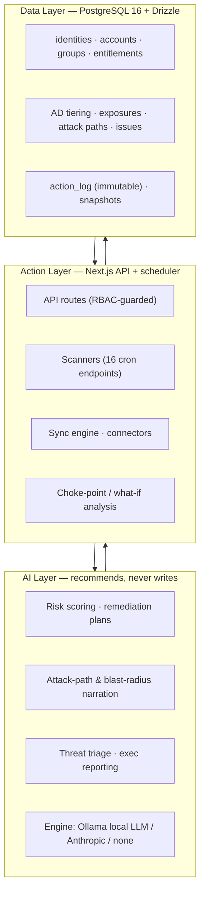
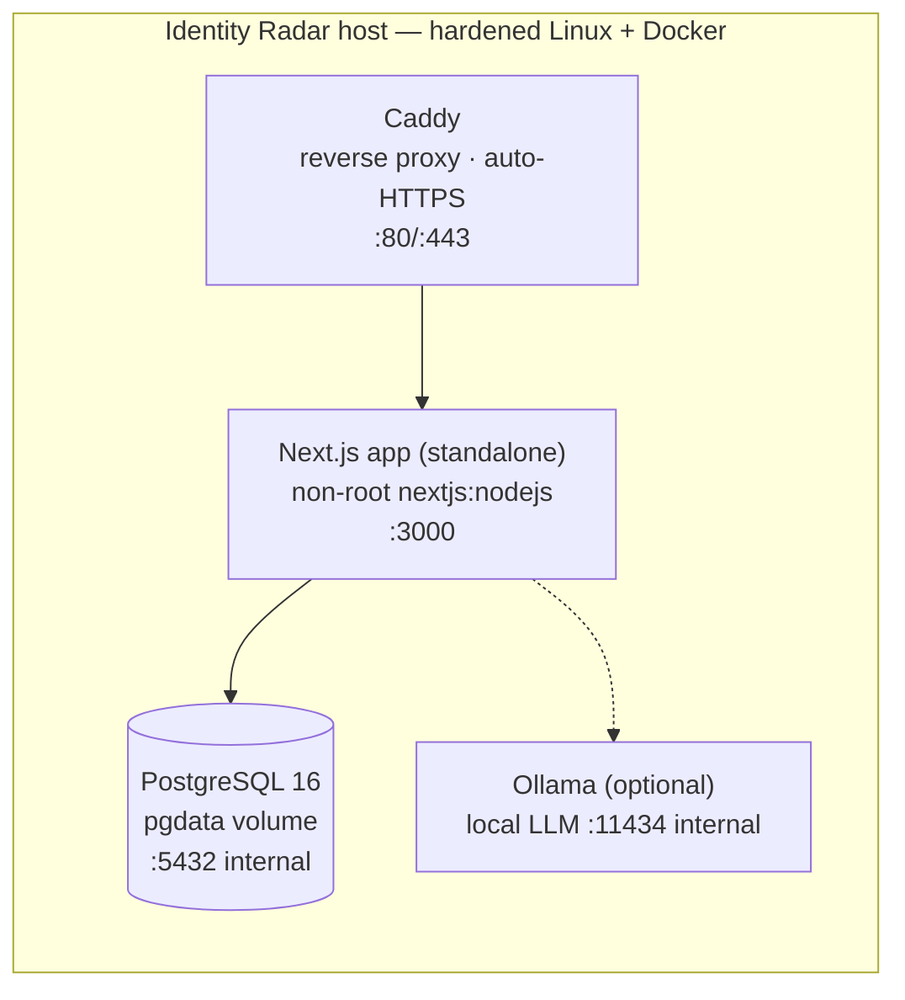
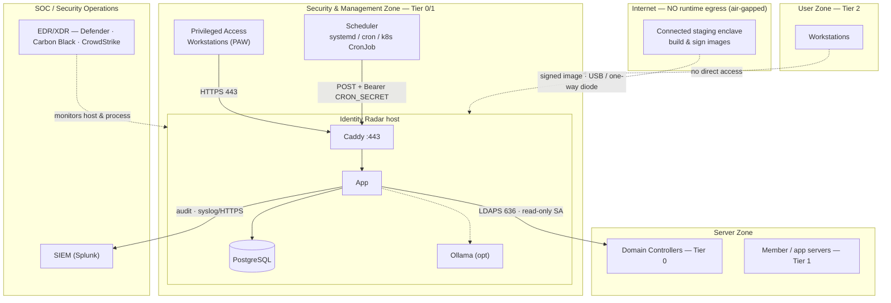
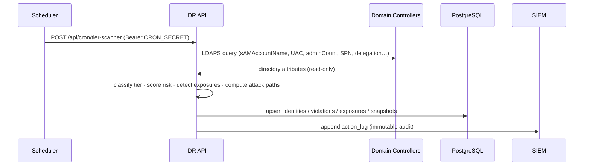
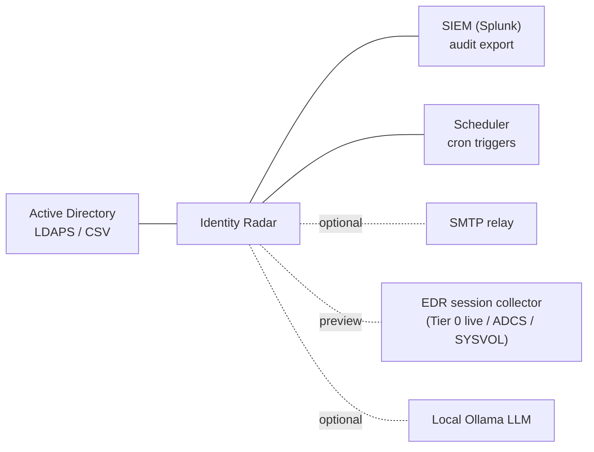
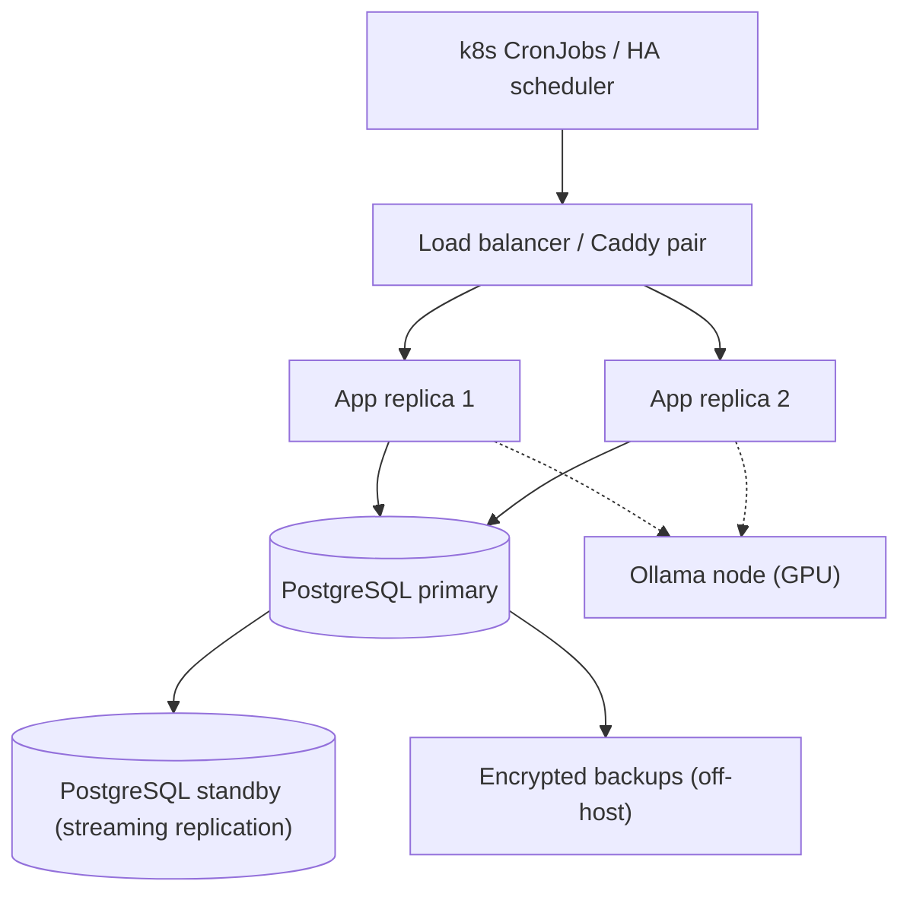

# Identity Radar — Solution Architecture

> Enterprise solution architecture for deploying Identity Radar into a segmented,
> EDR-monitored, air-gapped-capable network (built for banks/government under
> NCA ECC, SAMA CSF, PDPL). Companion to the
> [Hardened-environment guide](../deployment/hardened-environment.md) and the
> [SOC change-record template](../deployment/soc-change-record-template.md).

---

## 1. Architecture principles

| # | Principle | How it shows up |
|---|---|---|
| 1 | **Sovereign / air-gapped by default** | No runtime egress; all compute, data, and AI stay on-prem. Internet is only touched in a connected *staging* enclave to build images. |
| 2 | **Least privilege end to end** | Read-only AD service account; 5-role RBAC; non-root containers; credentials encrypted at rest. |
| 3 | **Treat the platform as a Tier 0-adjacent asset** | It reads privileged directory data and holds a directory service account, so it lives in the security/management zone and is protected like Tier 0. |
| 4 | **Identity-first data model** | One `identities` table (human + non-human); every other object links to it. |
| 5 | **AI recommends, humans approve** | AI never writes to the DB; it produces recommendations gated by RBAC approval. |
| 6 | **Everything auditable** | Every mutation → an immutable `action_log` entry → streamed to SIEM. |
| 7 | **Coordinate with the SOC, don't evade** | Scanner behaviour resembles recon; it is declared and allow-listed, not hidden. |

---

## 2. Logical architecture (three layers)

- **Data layer** — PostgreSQL 16 (Drizzle ORM). Source of truth; ~40 tables.
- **Action layer** — Next.js 14 App Router API routes + a Node scheduler driving 16 scanners; connectors ingest AD; analysis engines compute attack paths / choke-points.
- **AI layer** — pluggable (`AI_PROVIDER = ollama | anthropic | none`); consumes data, returns recommendations only.

---

## 3. Component / deployment view (single node)

- Services from `docker/docker-compose.prod.yml`: **db**, **app**, **caddy** (Ollama added when local AI is enabled). Only Caddy exposes ports (80/443); DB and Ollama stay on the internal Docker bridge.
- App is `output: standalone`, runs as non-root, with CPU/memory limits set per service.
- Secrets via env: `NEXTAUTH_SECRET`, `CREDENTIALS_KEY` (encrypts connector creds), `CRON_SECRET` (scanners fail-closed without it).

---

## 4. Enterprise network placement (the core of "matches the network")

Identity Radar is mapped onto the standard tiered-admin enterprise topology. It sits in the **Security & Management zone** — never the DMZ, never the user zone.

**Zone rationale**
- **Admin UI** reachable only from **PAW / management network** (Caddy + firewall). Standard user workstations have no path to it.
- **Collection** is a single outbound flow: IDR → Domain Controllers on **LDAPS (636)**, read-only.
- **Scanners** are triggered from an internal scheduler with a bearer token — not exposed externally.
- **Audit** flows out to the SIEM; **EDR/XDR** agents monitor the host (see §7).
- **No internet.** Images are built/signed in a connected staging enclave and moved in via USB or a one-way data diode.

---

## 5. Network & firewall design

Least-privilege flow matrix (allow-list; default deny):

| # | Source | Destination | Port/Proto | Purpose | Notes |
|---|--------|-------------|-----------|---------|-------|
| 1 | IDR app host | each Domain Controller | **636/TCP (LDAPS)** | AD attribute read | Prefer 636; avoid cleartext 389 |
| 2 | PAW / mgmt net | IDR (Caddy) | **443/TCP** | Admin UI | Restrict source to mgmt CIDR |
| 3 | Scheduler | IDR (Caddy) | 443/TCP | Trigger `/api/cron/*` | `Authorization: Bearer $CRON_SECRET` |
| 4 | IDR app host | SIEM collector | 6514/TCP (syslog-TLS) or 443 | Audit-log export | |
| 5 | IDR app host | SMTP relay (optional) | 587/TCP | Notifications | Only if email enabled |
| 6 | IDR containers | internal bridge | 5432, 11434 | DB, Ollama | **Never host-exposed** |
| 7 | IDR app host | **Internet** | any | — | **DENY** (air-gapped) |
| 8 | Staging enclave | IDR host | out-of-band | Image transfer | USB / one-way; not a live route |

Give the SOC the **fixed source IP** of the IDR host so LDAP-recon detections are attributable (see §7 and the SOC change record).

---

## 6. Data flows

### 6.1 Collection & scanning

### 6.2 Analyst / response
Analyst (from PAW) → Caddy → App → reads posture, runs choke-point / what-if, works Issues to closure. Any mutation is RBAC-checked, written with an `action_log` entry, and (for AI plans) requires human approval. **AI never writes directly.**

**Collection modes**
- **LDAPS (live)** — identity inventory, tiering, risk, identity exposures (Kerberoast/AS-REP/delegation/etc.).
- **CSV (offline)** — same identity data where no route to DCs exists.
- **Preview (collector pending)** — ADCS/GPO/secret exposures and Tier 0 live sessions require a dedicated collector (logon telemetry / EDR); labelled as preview in-product.

---

## 7. Security architecture

| Domain | Control |
|--------|---------|
| **AuthN** | NextAuth v5 session; admin UI behind Caddy TLS, restricted to mgmt network. |
| **AuthZ** | 5-role RBAC (`viewer < analyst < iam_admin < ciso < admin`) enforced in API middleware + UI. Every mutating route role-gated. |
| **Tenant isolation** | Every query scoped by `orgId` (multi-tenant safe; no cross-org access). |
| **Secrets** | Connector credentials AES-256-GCM encrypted with `CREDENTIALS_KEY`. `.env` never committed. No secrets in logs/responses. |
| **Service account** | Dedicated, read-only, no privileged group membership, LDAPS, audited. |
| **SSRF guard** | Connector/webhook URLs blocked from loopback/link-local/metadata; private LAN intentionally allowed (on-prem). |
| **Scanner auth** | `/api/cron/*` fail-closed in production without `CRON_SECRET`. |
| **Audit** | Immutable `action_log` for every action → SIEM. |
| **EDR/XDR coexistence** | Scanner behaviour resembles LDAP recon (SharpHound-like). Declare the host + service account to the SOC and apply **scoped** allow-list exceptions in MDI/MDE/Carbon Black/CrowdStrike — never disable detections globally. See the hardened-environment guide. |
| **Host hardening** | Non-root containers, resource limits, internal-only DB/AI, TLS everywhere. |

---

## 8. Integration architecture

- **Active Directory** — primary source (LDAPS connector or CSV import).
- **SIEM** — audit-log egress (syslog-TLS or HTTPS).
- **Scheduler** — external cron/systemd/k8s CronJob calling the 16 scanner endpoints with the bearer token (no built-in scheduler by design — keeps the runtime stateless and lets ops control cadence).
- **Optional/preview** — SMTP notifications; local Ollama; a future EDR/logon-telemetry collector to make ADCS/GPO/secret and Tier 0-live feeds live.

---

## 9. Deployment topologies

### 9.1 Single node (MVP / branch office)
One hardened Linux host, `docker compose -f docker/docker-compose.prod.yml up -d`. Suitable up to ~50k identities. Simplest to air-gap and audit.

### 9.2 High availability (enterprise)

- App scaled horizontally behind an LB (stateless — sessions are JWT); PostgreSQL primary/standby with streaming replication + PITR backups; Ollama on a GPU node; scanners as Kubernetes CronJobs. Kubernetes variant: app `Deployment`, Postgres managed/StatefulSet, scanners `CronJob`, secrets in the cluster secret store / Vault.

### 9.3 Air-gapped install
Build & sign the image in a connected staging enclave → `scripts/bundle-offline.sh` → transfer via USB/diode → `install.sh` on the isolated host. No registry pull at runtime.

---

## 10. High availability, DR & backup

| Concern | Approach |
|---|---|
| **App availability** | Stateless app; N replicas behind LB; rolling deploys. |
| **DB availability** | Primary/standby streaming replication; automatic failover (Patroni/managed). |
| **Backup** | `scripts/backup.sh` (nightly, rotated, encrypted, off-host); PITR via WAL archiving. |
| **Restore/DR** | `scripts/restore.sh`; documented RTO/RPO; standby in a second data centre for regional DR. |
| **Config as code** | Compose/Helm + `.env.production.example` under change control; no snowflake hosts. |

---

## 11. Software supply chain (air-gapped)

1. Build the container image in a **connected staging enclave** (`npm ci --legacy-peer-deps` + `next build`).
2. Scan (SBOM, `npm audit`) and **sign** the image.
3. Transfer the signed image + Ollama model via **USB or one-way diode**.
4. Verify signature and run on the isolated host — **no runtime registry access**.

---

## 12. Compliance mapping (indicative)

| Framework | How the architecture supports it |
|---|---|
| **NCA ECC** | Identity & access governance, privileged-access (Tier 0) control, audit logging, network segmentation, on-soil data residency. |
| **SAMA CSF** | Access management, threat detection/response (ITDR), continuous monitoring, immutable audit trail, change control (SOC record). |
| **PDPL** | Data minimisation (reads directory attributes only), on-prem residency (no cross-border transfer), access controls, auditability. |

Controls are also **scored in-product** on the Compliance dashboard (NCA ECC · SAMA CSF · PDPL).

---

## 13. Sizing (rule of thumb)

| Identities | App | PostgreSQL | Ollama (if local AI) |
|---|---|---|---|
| ≤ 10k | 2 vCPU / 2 GB | 2 vCPU / 2 GB | CPU-only, `qwen2.5:1.5b` |
| ≤ 50k | 4 vCPU / 4 GB | 4 vCPU / 8 GB | 8 GB RAM (`:7b`) or GPU |
| 50k+ | HA (§9.2), 2+ app replicas | Primary/standby, 8+ vCPU | GPU node |

---

### Summary
Identity Radar deploys as a small, self-contained, non-root Docker stack placed in the **security/management zone** of a tiered enterprise network: a single read-only **LDAPS** flow to the Domain Controllers, admin UI limited to **PAW/management**, audit streamed to the **SIEM**, scanners driven by an **internal scheduler**, **EDR/XDR** monitoring the host with scoped allow-listing, and **zero internet egress**. It scales from a single air-gapped node to an HA/Kubernetes topology without changing the security model.
