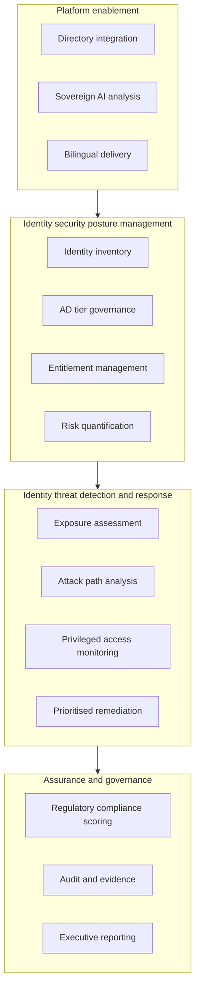
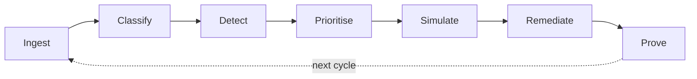
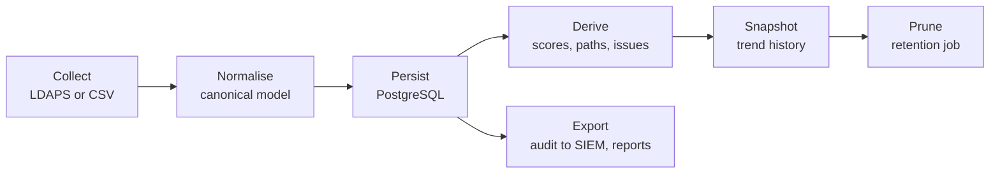
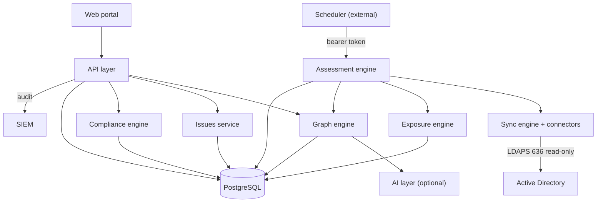
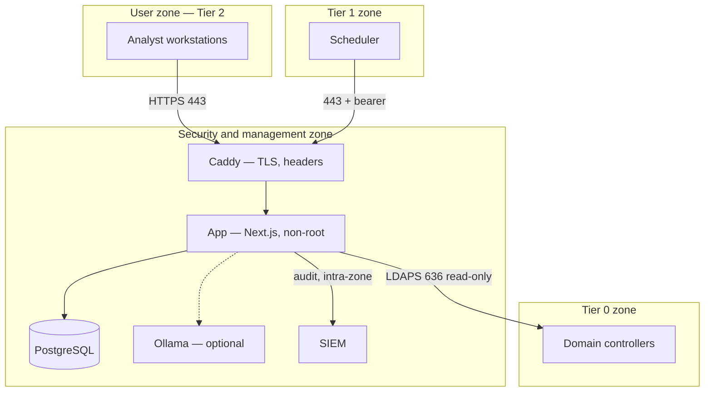
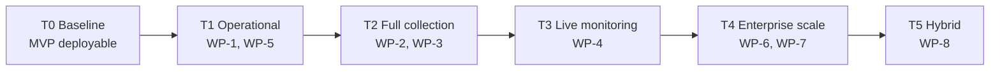

# Identity Radar — Architecture Definition Document (TOGAF ADM)

> The architecture expressed as a TOGAF deliverable set, organised by ADM phase with the
> standard catalogs, matrices and diagrams.
>
> **Relationship to the other documents.** TOGAF answers *how the architecture is developed
> and governed*; the [ITIL service architecture](./service-architecture-itil.md) answers *how
> the resulting service is run*. They are complementary, not alternatives — Phase G hands the
> Architecture Contract to the ITIL service owner. Network topology detail lives in the
> [Solution Architecture](./solution-architecture.md).
>
> Baseline verified 2026-07-27: 48 database tables · 121 API routes · 36 pages (17 in MVP
> navigation) · 16 scheduled scanners · 14 connectors · 199 automated tests · 836 i18n keys
> per locale (EN/AR).

---

## 0. Artifact index

| ADM phase | Deliverable | Artifacts in this document |
|---|---|---|
| Preliminary | Architecture principles, governance framework | [Principles catalog](#11-principles-catalog), [governance model](#12-architecture-governance-framework) |
| A — Vision | Architecture Vision, Statement of Work | [Vision](#2-phase-a--architecture-vision), [stakeholder map matrix](#22-stakeholder-map-matrix) |
| B — Business | Business Architecture | [Actor/role catalog](#31-actor-and-role-catalog), [capability map](#32-business-capability-map), [value stream](#33-value-stream), [business service catalog](#34-business-service-catalog), [capability/organisation matrix](#35-capability-to-organisation-matrix) |
| C — Data | Data Architecture | [Data entity catalog](#41-data-entity-catalog), [entity/function matrix](#42-data-entity-to-business-function-matrix), [classification](#43-data-classification-and-residency), [lifecycle diagram](#44-data-lifecycle) |
| C — Application | Application Architecture | [Application portfolio catalog](#51-application-portfolio-catalog), [communication diagram](#52-application-communication-diagram), [application/function matrix](#53-application-to-function-matrix), [ABB/SBB](#54-architecture-and-solution-building-blocks) |
| D — Technology | Technology Architecture | [Technology portfolio](#61-technology-portfolio-catalog), [standards catalog](#62-technology-standards-catalog), [environments and locations](#63-environments-and-locations-diagram), [network flow matrix](#64-network-flow-matrix) |
| E — Opportunities | Gap analysis, work packages | [Gap analysis](#71-gap-analysis-baseline-to-target), [work packages](#72-work-packages) |
| F — Migration | Roadmap, transition architectures | [Transition architectures](#81-transition-architectures), [roadmap](#82-implementation-roadmap) |
| G — Governance | Architecture Contract, compliance review | [Contract](#91-architecture-contract), [compliance checkpoints](#92-architecture-compliance-review) |
| H — Change | Change management process | [Change classification](#10-phase-h--architecture-change-management) |
| Requirements | Architecture Requirements Specification | [Requirements](#11-requirements-management) |

---

## 1. Preliminary phase

### 1.1 Principles catalog

TOGAF principles are stated as *name · statement · rationale · implications*.

| # | Principle | Statement | Rationale | Implications |
|---|---|---|---|---|
| **P1** | Data sovereignty | Identity data never leaves the customer's premises | Gulf regulators and PDPL prohibit cross-border transfer of personal data; banks reject foreign SaaS | No runtime egress; AI must run locally; images built in a connected staging enclave and transferred |
| **P2** | Identity-first | Human and non-human identities share one model | They share one escalation surface; splitting them duplicates logic and hides NHI risk | Single `identities` table with a type discriminator; all objects reference it |
| **P3** | Least privilege | Every actor gets the minimum access needed | The platform reads privileged directory data and is itself a target | Read-only AD service account; 5-role RBAC; non-root containers; no AD write-back |
| **P4** | Human authority over change | Automated analysis, human decision | Auto-changing Active Directory is unacceptable operational risk | AI writes no rows; remediation is produced as scripts for the existing AD change process |
| **P5** | Total auditability | Every mutation is recorded immutably | SAMA/NCA require evidence of control operation | Append-only `action_log`; SIEM export; actor and timestamp on every action |
| **P6** | Tier classification is first-class | Every identity, group and resource carries a tier | Tiering is the control being enforced, not a report attribute | Tier fields in the core schema; tier violation is a first-class finding |
| **P7** | Declared behaviour | Security-visible activity is declared, never disguised | Collection resembles reconnaissance and will alert | SOC change record; scoped EDR allow-listing; re-validation on change |
| **P8** | Bilingual by design | Arabic is a first-class language | Target market requires Arabic for regulators and operators | Logical CSS properties; EN/AR key parity enforced in CI; self-hosted Arabic typeface |
| **P9** | Stateless application tier | State lives only in the database | Enables horizontal scaling and simple recovery | JWT sessions; external scheduler; no in-process cron |
| **P10** | Graceful degradation | Loss of an optional dependency must not stop the service | Air-gapped sites have fewer recovery options | AI absent → features hide; SIEM absent → audit retained locally |

### 1.2 Architecture governance framework

| Element | Definition |
|---|---|
| Architecture board | Security architecture lead (chair), IAM lead, infrastructure lead, SOC representative, service owner |
| Scope of authority | The Identity Radar solution architecture and its interfaces to AD, SIEM and the network |
| Compliance mechanism | Architecture compliance review at each Phase G checkpoint (§9.2) |
| Dispensation | Time-boxed, recorded, with a compensating control and an expiry date |
| Repository | This `docs/architecture/` folder under version control; changes reviewed with the code |
| Re-entry trigger | Any change to collection behaviour, zone placement, or data residency re-enters the ADM at Phase A (§10) |

---

## 2. Phase A — Architecture vision

### 2.1 Vision statement

> For **CISOs, IAM engineers and security analysts in regulated Gulf institutions**, who must
> prove control over privileged access without exporting identity data, Identity Radar is a
> **sovereign identity security posture and threat-response platform** that maps every path an
> attacker could take to Tier 0 and names the fewest changes that close them — running entirely
> on-premises, with local AI, in Arabic and English, mapped to NCA ECC, SAMA CSF and PDPL.
>
> Unlike BloodHound Enterprise, PingCastle or Defender for Identity, it operates **fully
> air-gapped with no cloud dependency**.

### 2.2 Stakeholder map matrix

TOGAF form: stakeholder · concern · viewpoint that addresses it.

| Stakeholder | Key concerns | Viewpoint / artifact addressing them |
|---|---|---|
| **CISO** | Board-reportable risk; regulatory defensibility; cost | Vision (§2.1), business capability map (§3.2), compliance traceability (§12.1) |
| **IAM engineer** | Can it enforce tiering? How much manual work? | Value stream (§3.3), application portfolio (§5.1) |
| **Security analyst** | Can I investigate a path and prove a fix? | Application communication (§5.2), business services (§3.4) |
| **Security architect** | Zone placement; blast radius; is the tool itself a risk? | Environments and locations (§6.3), network flow matrix (§6.4) |
| **SOC manager** | Will this generate alerts? Will it be contained? | Principle P7, network flow matrix (§6.4), change classification (§10) |
| **Infrastructure lead** | What do I run, size and back up? | Technology portfolio (§6.1), standards catalog (§6.2) |
| **Data protection officer** | What personal data, held where, for how long? | Data classification and residency (§4.3), lifecycle (§4.4) |
| **Internal audit** | Evidence that controls operate | Principle P5, data entity catalog (§4.1), compliance traceability (§12.1) |
| **Programme sponsor** | Time to value; what's not built yet | Gap analysis (§7.1), roadmap (§8.2) |

### 2.3 Scope and constraints

| Dimension | In scope | Out of scope (this cycle) |
|---|---|---|
| Identity sources | On-premises Active Directory via LDAPS; CSV import | Entra ID, AWS, GCP identity graphs |
| Assessment | Identity posture, tiering, exposures, attack paths, choke points | Live ADCS/SYSVOL collection, live session telemetry |
| Action | Recommendation and evidence | Automated write-back to Active Directory |
| Deployment | Single-node air-gapped; HA documented | Multi-tenant SaaS |
| Languages | English, Arabic | Others |

**Constraints:** no runtime internet egress (P1); read-only directory access (P3); the platform
must coexist with EDR/XDR without disabling detections (P7).

---

## 3. Phase B — Business architecture

### 3.1 Actor and role catalog

| Actor | Type | Platform role | Business responsibility |
|---|---|---|---|
| CISO | Human | `ciso` | Accepts risk, approves exceptions and remediation plans |
| IAM engineer | Human | `iam_admin` | Onboards sources, certifies access, executes AD remediation |
| Security analyst | Human | `analyst` | Triages exposures, investigates paths, runs simulations |
| Internal auditor | Human | `viewer` | Reviews evidence, exports compliance reports |
| Data protection officer | Human | `viewer` | Confirms residency and minimisation |
| Platform operator | Human | `admin` | Deploys, patches, backs up, manages users and keys |
| SOC analyst | Human | — (SIEM side) | Tunes detections, validates the platform's own behaviour |
| Scheduler | System | — (bearer token) | Triggers the 16 assessment scanners |
| Assessment engine | System | — | Executes posture, exposure and path analysis |

### 3.2 Business capability map

| Capability | Maturity (baseline) | Target |
|---|---|---|
| Identity inventory | Operational | Operational |
| AD tier governance | Operational | Operational |
| Exposure assessment | Partial — identity checks live; ADCS/GPO/secrets not collected | Full collection |
| Attack path analysis | Operational | Operational |
| Privileged access monitoring | Not operational — sample data only | Live session telemetry |
| Prioritised remediation | Operational (choke points, what-if, issues) | Operational |
| Compliance scoring | Operational | Operational |
| Sovereign AI analysis | Operational, optional | Validated Arabic-capable model |

### 3.3 Value stream

| Stage | Capability | Actor | Value added | Constraint |
|---|---|---|---|---|
| Ingest | Directory integration | Scheduler (system) | Current directory state | LDAP volume agreed with SOC |
| Classify | Tiering, risk quantification | Assessment engine | Tier + risk per identity | — |
| Detect | Exposure, path analysis | Assessment engine | Findings and paths | — |
| Prioritise | Choke-point analysis | Security analyst | Ranked minimal fix set | Analyst availability |
| Simulate | What-if | Analyst / IAM engineer | Predicted impact before change | — |
| Remediate | Prioritised remediation | IAM engineer | Reduced attack surface | CISO approval + AD change window |
| Prove | Compliance, audit | Auditor / CISO | Regulatory evidence | — |

### 3.4 Business service catalog

| Business service | Description | Consumer | Supporting application service |
|---|---|---|---|
| Posture assessment | Inventory, tiering compliance, risk scoring | IAM engineer | Assessment engine, portal |
| Exposure and threat detection | Findings by attack impact; paths; live Tier 0 access | Security analyst | Exposure engine, graph engine |
| Prioritised remediation | Choke-point fix list, simulation, issue workflow | IAM engineer | Graph engine, issues service |
| Compliance evidence | NCA/SAMA/PDPL control scoring and export | Audit, CISO | Compliance engine, reporting |
| Directory onboarding | Connect a domain or CSV source | IAM engineer | Sync engine, connectors |

### 3.5 Capability-to-organisation matrix

| Capability | IAM function | Security operations | Audit / risk | IT infrastructure |
|---|:--:|:--:|:--:|:--:|
| Identity inventory | **Owns** | Uses | Uses | — |
| AD tier governance | **Owns** | Uses | Uses | Supports |
| Exposure assessment | Uses | **Owns** | Uses | — |
| Attack path analysis | Uses | **Owns** | — | — |
| Privileged access monitoring | Uses | **Owns** | — | Supports |
| Prioritised remediation | **Owns** | Uses | — | Supports |
| Compliance scoring | Uses | Uses | **Owns** | — |
| Directory integration | **Owns** | Consulted | — | Supports |
| Platform operation | — | Consulted | — | **Owns** |

---

## 4. Phase C — Data architecture

### 4.1 Data entity catalog

| Data entity | Description | Master? | Source of record | Approx. table group |
|---|---|---|---|---|
| **Identity** | Human or non-human principal | **Yes — master entity** | Active Directory (via sync) | `identities`, `identity_aliases` |
| Account | Directory account bound to an identity | No | Active Directory | `accounts` |
| Group | Security or distribution group | No | Active Directory | `groups`, `group_memberships` |
| Resource | Protected asset (DC, server, application) | No | Directory + configuration | `resources` |
| Entitlement | Permission held by an identity over a resource | No | Derived from directory | `entitlements` |
| Policy | Rule defining a violation | Yes | Platform | `policies` |
| Violation | Breach of a policy by an identity | No | Derived | `policy_violations` |
| Exposure finding | Non-identity exposure (certificate, GPO, secret) | No | Derived | `exposure_findings` |
| Attack path | Escalation chain to Tier 0 | No | Derived (graph) | `attack_paths` |
| Issue | Managed roll-up of findings | No | Derived | `issues`, `issue_statuses` |
| Tier 0 session | Live privileged logon | No | Session telemetry (**gap**) | `tier0_sessions` |
| Posture snapshot | Point-in-time metric set | No | Derived | `posture_snapshots` |
| Action log entry | Immutable record of a mutation | **Yes** | Platform | `action_log` |
| Organisation | Tenant boundary | Yes | Platform | `organizations` |
| Integration source | Configured connector | Yes | Platform | `integration_sources` |

### 4.2 Data entity to business function matrix

Legend: C = create, R = read, U = update, D = delete

| Entity | Directory integration | Tiering | Exposure assessment | Path analysis | Remediation | Compliance | Audit |
|---|:--:|:--:|:--:|:--:|:--:|:--:|:--:|
| Identity | **CRU** | RU | R | R | R | R | R |
| Account | **CRU** | R | R | — | R | R | — |
| Group / membership | **CRU** | R | R | R | R | R | — |
| Entitlement | **CRU** | R | R | R | RU | R | — |
| Resource | **CRU** | R | — | R | R | R | — |
| Violation | — | **C** | **C** | — | RU | R | R |
| Exposure finding | — | — | **CRU** | R | R | R | R |
| Attack path | — | — | — | **CRU** | R | R | — |
| Issue | — | — | C | C | **CRU** | R | R |
| Posture snapshot | — | C | **C** | C | — | R | — |
| Action log | C | C | C | C | **C** | R | **R** |

### 4.3 Data classification and residency

| Class | Examples | Protection | Residency | Retention |
|---|---|---|---|---|
| **Secret** | AD service-account password, API keys, webhook secrets | AES-256-GCM at rest (`CREDENTIALS_KEY`); never logged or returned by an API | On-premises only | Until rotated |
| **Confidential — personal** | Display name, UPN, email, department, manager | PDPL scope; minimised to posture-relevant attributes; RBAC-gated | **On-premises only; no cross-border transfer** | While present in the source |
| **Confidential — security** | Exposures, attack paths, tier violations, sessions | `analyst` role and above | On-premises only | Current state + snapshot history |
| **Internal** | Aggregate scores, trends, compliance scores | `viewer` and above | On-premises | Long-lived (trend analysis) |
| **Audit** | `action_log` | Append-only; not truncated by the application | On-premises + SIEM (same security zone) | Per audit policy |

**Minimisation control:** the LDAP connector requests an explicit attribute allow-list. No
photographs, no HR attributes, no group descriptions beyond what tiering requires.

### 4.4 Data lifecycle

---

## 5. Phase C — Application architecture

### 5.1 Application portfolio catalog

| Application component | Function | Criticality | Status |
|---|---|---|---|
| Web portal | UI, SSR, bilingual presentation | High | Operational |
| API layer | AuthN/Z, validation, CRUD, audit (121 routes) | High | Operational |
| Assessment engine | 16 scheduled scanners | High | Operational — **requires external scheduler** |
| Sync engine and connectors | Ingest and normalise (14 connectors; LDAP + CSV in MVP) | High | Operational |
| Exposure engine | Posture checks, ADCS, GPO, secret scanning | High | Partial — identity checks live, others uncollected |
| Graph engine | Traversal, queries, choke points, what-if | High | Operational |
| Issues service | Catalog, roll-up, status workflow, timeline | Medium | Operational |
| Compliance engine | NCA / SAMA / PDPL control scoring | Medium | Operational |
| AI layer | Narration, triage, reporting | Low (optional) | Operational, optional |
| Session service | Tier 0 live access | Medium | **Sample data only — collector missing** |

### 5.2 Application communication diagram

### 5.3 Application-to-function matrix

| Application component | Ingest | Classify | Detect | Prioritise | Simulate | Remediate | Prove |
|---|:--:|:--:|:--:|:--:|:--:|:--:|:--:|
| Sync engine / connectors | ● | | | | | | |
| Assessment engine | ● | ● | ● | | | | |
| Exposure engine | | | ● | | | | |
| Graph engine | | | ● | ● | ● | | |
| Issues service | | | | ● | | ● | ● |
| Compliance engine | | | | | | | ● |
| API layer | ● | ● | ● | ● | ● | ● | ● |
| Web portal | | | ● | ● | ● | ● | ● |
| AI layer | | | ○ | ○ | | ○ | ○ |

● primary · ○ optional augmentation

### 5.4 Architecture and solution building blocks

| Architecture building block (ABB) | Solution building block (SBB) | Substitutable? |
|---|---|---|
| Directory collection service | LDAP connector (`ldapjs`) / CSV importer | Yes — connector interface is abstract |
| Identity repository | PostgreSQL 16 + Drizzle ORM | Difficult — relational integrity assumed |
| Graph analysis service | In-process TypeScript traversal engine | Yes — could move to a graph database at scale |
| Authorisation service | NextAuth v5 + custom 5-role RBAC | Yes — OIDC provider could substitute |
| Secret protection service | AES-256-GCM envelope (`CREDENTIALS_KEY`) | Yes — HashiCorp Vault is an alternative SBB |
| AI inference service | Ollama (local) / Anthropic API / none | **Yes — explicitly pluggable** |
| Reverse proxy and TLS | Caddy 2 | Yes — nginx/Traefik equivalent |
| Audit sink | `action_log` + syslog-TLS export | Yes — any SIEM |
| Scheduling service | External systemd timer / cron / k8s CronJob | **Yes — deliberately external** |

---

## 6. Phase D — Technology architecture

### 6.1 Technology portfolio catalog

| Layer | Product | Version | Role |
|---|---|---|---|
| Presentation | Next.js (App Router), React, Tailwind CSS | 14 / 4 | UI and SSR |
| Internationalisation | next-intl, self-hosted IBM Plex (Sans/Mono/Arabic) | — | EN/AR RTL |
| Visualisation | Recharts, D3 | — | Charts and force graph |
| Runtime | Node.js, TypeScript | 20 LTS | Application runtime |
| Authentication | NextAuth | v5 | Sessions |
| Validation | Zod | 4 | Boundary validation |
| Persistence | PostgreSQL, Drizzle ORM | 16 / 0.45 | System of record |
| AI runtime | Ollama (`qwen2.5`) | — | Local inference (optional) |
| Proxy / TLS | Caddy | 2 | TLS termination, security headers |
| Container platform | Docker Compose (reference) / Kubernetes | — | Runtime platform |
| Quality | Vitest, Playwright | — | Test automation |

### 6.2 Technology standards catalog

| Domain | Standard | Status |
|---|---|---|
| Transport security | TLS 1.2+; LDAPS 636 (plain 389 prohibited) | Mandated |
| Credential storage | AES-256-GCM at rest; bcrypt cost 12 for passwords | Mandated |
| Container security | Non-root user; no published ports except the proxy; per-service resource limits | Mandated |
| Directory access | Read-only service account; explicit attribute allow-list; no write-back | Mandated |
| Scanner authentication | Bearer token; fail-closed in production | Mandated |
| Audit | Append-only; exported to SIEM | Mandated |
| Egress | Default-deny; no runtime internet access | Mandated |
| AI | Local inference by default; cloud API prohibited in sovereign deployments | Mandated |
| Supply chain | Build, scan (SBOM), sign in staging enclave; no runtime registry pull | Mandated |
| Language parity | EN/AR key parity enforced in CI | Mandated |

### 6.3 Environments and locations diagram

The zone model, as corrected:

| Zone | Tier | Contents | Rationale |
|---|---|---|---|
| User zone | Tier 2 | Analyst workstations | Portal is consumed from standard workstations; RBAC is therefore the primary control |
| Tier 1 zone | Tier 1 | Scheduler | Server-side automation, not a user endpoint |
| Security and management zone | Tier 0-adjacent | Identity Radar host + SIEM | Holds a directory credential and the full privilege graph; co-locating the SIEM keeps audit in-zone |
| Tier 0 zone | Tier 0 | Domain controllers only | The protected asset; isolated from all other systems |

**Environment strategy**

| Environment | Connectivity | Data | Purpose |
|---|---|---|---|
| Development | Internet allowed | Synthetic seed | Feature work |
| Staging enclave | Internet allowed (build only) | Synthetic | Build, scan, sign images |
| Pre-production | Internal only | Copy or subset | Acceptance, EDR tuning |
| **Production** | **Air-gapped** | Real directory data | Live assessment — never seeded |

### 6.4 Network flow matrix

| # | Source | Destination | Protocol / port | Direction | Control |
|---|---|---|---|---|---|
| 1 | User zone (Tier 2) | Caddy | HTTPS 443 | Inbound | Session + RBAC; TLS, HSTS, CSP |
| 2 | Tier 1 zone (scheduler) | Caddy | HTTPS 443 | Inbound | Bearer token, fail-closed |
| 3 | Caddy | App | HTTP 3000 | **Intra-host** | Internal bridge only |
| 4 | App | PostgreSQL | 5432 | **Intra-host** | Internal bridge only |
| 5 | App | Ollama | 11434 | **Intra-host** | Internal bridge only, optional |
| 6 | App | SIEM | syslog-TLS 6514 / HTTPS | **Intra-zone** | Append-only stream |
| 7 | App | Domain controllers | **LDAPS 636** | **Outbound — the only zone crossing** | Read-only service account; SOC-declared |
| 8 | Any | Internet | any | — | **Denied** |

The resulting firewall policy is three allow rules and a default deny.

---

## 7. Phase E — Opportunities and solutions

### 7.1 Gap analysis: baseline to target

| Capability | Baseline (as built) | Target | Gap | Severity |
|---|---|---|---|---|
| Identity posture and tiering | Operational | Operational | None | — |
| Attack path and choke-point analysis | Operational | Operational | None | — |
| Identity exposure detection | Operational (Kerberoast, AS-REP, delegation, password flags, stale privileged) | Operational | None | — |
| **Certificate/GPO/secret exposure** | Schema, checks and UI exist; **no collector** | Live collection from ADCS and SYSVOL | Build two collectors | **High** |
| **Live Tier 0 session monitoring** | UI and schema exist; **sample data only** | Live logon telemetry | Build session/EDR collector | **High** |
| **Assessment scheduling** | Endpoints exist; **no shipped scheduler config** | Scans run automatically on install | Ship systemd/cron/k8s templates | **High** |
| Availability | Single node | HA reference implementation | Build and load-test HA | Medium |
| Operational recovery | Backup scripts exist | Verified restore, documented runbooks | Automate verification; write runbooks | Medium |
| Arabic AI reporting | Works; quality tied to model size | Board-grade Arabic output | Validate a larger/Arabic-tuned model | Medium |
| Cloud identity coverage | On-premises AD only | Hybrid (Entra/AWS/GCP) | Extend graph model | Low (post-MVP) |

### 7.2 Work packages

| WP | Scope | Addresses gap | Depends on |
|---|---|---|---|
| **WP-1** | Scheduler templates (systemd timer, cron, k8s CronJob) with staggered cadence | Assessment scheduling | — |
| **WP-2** | ADCS certificate-template collector | Certificate exposure | — |
| **WP-3** | SYSVOL/GPP secret and GPO collector | GPO/secret exposure | — |
| **WP-4** | Logon telemetry / EDR session collector | Live Tier 0 monitoring | SOC agreement on telemetry source |
| **WP-5** | Operational runbooks + automated restore verification | Operational recovery | — |
| **WP-6** | HA reference build and load test | Availability | — |
| **WP-7** | Arabic-capable model validation and packaging | AI reporting quality | — |
| **WP-8** | Cloud identity graph extension | Hybrid coverage | WP-6 |

---

## 8. Phase F — Migration planning

### 8.1 Transition architectures

| Transition | State | Contents | Business value delivered |
|---|---|---|---|
| **T0 — Baseline** | Current | Posture, tiering, identity exposures, paths, choke points, issues, compliance | Deployable MVP; scans require manual scheduling |
| **T1 — Operational** | +WP-1, WP-5 | Automated scanning; runbooks; verified restore | Service runs unattended and is recoverable |
| **T2 — Full collection** | +WP-2, WP-3 | ADCS, GPO and secret exposures live | Preview categories become real coverage |
| **T3 — Live monitoring** | +WP-4 | Real Tier 0 session visibility | Detection shifts from periodic to near-real-time |
| **T4 — Enterprise scale** | +WP-6, WP-7 | HA topology; board-grade Arabic reporting | Availability targets provable; regulator-facing output |
| **T5 — Hybrid** | +WP-8 | Cloud identity graph | Coverage beyond on-premises AD |

### 8.2 Implementation roadmap

**Sequencing rationale:** T1 first because an unscheduled deployment silently collects nothing —
the highest-severity gap is operational, not functional. T2 before T3 because the collectors
share ingestion patterns. T4 is gated on real deployment load data rather than a date.

---

## 9. Phase G — Implementation governance

### 9.1 Architecture contract

Binding obligations on any deployment claiming conformance:

| # | Obligation | Verification |
|---|---|---|
| C1 | Deployed in the security and management zone; not the DMZ or a user segment | Network review |
| C2 | Directory account is read-only with no privileged group membership | AD audit |
| C3 | `CREDENTIALS_KEY`, `CRON_SECRET`, `NEXTAUTH_SECRET` set; none defaulted | Config review |
| C4 | No runtime internet egress from the host | Firewall review |
| C5 | Cloud AI key unset in sovereign deployments | Config review |
| C6 | Audit exported to the SIEM | SIEM record present |
| C7 | SOC change record filed and detections allow-listed before first scan | Signed record |
| C8 | Demo/seed data never loaded in production | Go-live checklist |
| C9 | Backups configured with a verified restore | Restore test evidence |
| C10 | `admin` and `ciso` role assignment reviewed at least annually | Access review record |

### 9.2 Architecture compliance review

| Checkpoint | When | Assesses |
|---|---|---|
| Design review | Before build | Zone placement, data flows, contract C1–C5 |
| Pre-deployment review | Before production | C1–C9, SOC change record, test evidence |
| Coordinated first scan | Go-live | Expected detections only; no auto-containment |
| Post-implementation review | 30 days after go-live | Scan freshness, alert volume, exception scope |
| Periodic review | Annual, or on ADM re-entry | Full contract; drift from the target architecture |

**Dispensation:** any deviation must be recorded with a compensating control and an expiry date.
Example: a site without a SIEM may retain audit locally, provided retention and backup are
extended — expiring when the SIEM is available.

---

## 10. Phase H — Architecture change management

| Change class | Examples | Response |
|---|---|---|
| **Simplification** | Reduce scan cadence; remove an unused connector | Implement under normal change control |
| **Incremental** | New exposure check; new dashboard; dependency patch | Implement; update the Architecture Definition Document |
| **Re-architecting** | New identity source type; cloud identity graph; write-back to AD; changing zone placement or data residency | **Re-enter the ADM at Phase A** |

**Mandatory ADM re-entry triggers**
1. Any change to what is read from Active Directory, or from where — new detection signatures, requiring SOC re-validation (P7).
2. Any change to data residency or introduction of cloud processing — violates P1 unless re-approved.
3. Any proposal for automated write-back to Active Directory — violates P4.
4. A change of zone placement for the platform, SIEM or domain controllers.

---

## 11. Requirements management

Architecture Requirements Specification — the requirements that constrain every phase.

| ID | Requirement | Type | Source | Verification |
|---|---|---|---|---|
| **AR-01** | No identity data leaves the customer premises at runtime | Constraint | P1, PDPL | Firewall review; config audit |
| **AR-02** | Directory access is read-only | Constraint | P3, P7 | Code review; AD audit |
| **AR-03** | Every mutation produces an immutable audit record | Functional | P5, SAMA | `action_log` inspection |
| **AR-04** | Authorisation enforced at the API boundary, not only in the UI | Functional | P3 | Route-level test coverage |
| **AR-05** | All queries scoped to a single tenant | Functional | P3 | Code review |
| **AR-06** | AI produces no database writes | Constraint | P4 | Code review |
| **AR-07** | Assessment endpoints reject unauthenticated calls in production | Functional | P3 | Negative test |
| **AR-08** | Full function available in Arabic with RTL layout | Functional | P8 | i18n parity check in CI |
| **AR-09** | Service remains functional with AI disabled | Functional | P10 | Test with AI off |
| **AR-10** | Recovery within RTO 1 hour, RPO 15 minutes | Non-functional | Continuity | Restore rehearsal |
| **AR-11** | Analysis workloads are bounded and cannot exhaust the host | Non-functional | Availability | Load test; work-budget review |
| **AR-12** | Platform behaviour is declared to the SOC before first scan | Constraint | P7 | Signed change record |

---

## 12. Appendices

### 12.1 Compliance traceability

| Framework requirement | Architecture response | Artifact |
|---|---|---|
| NCA ECC — identity and access management | Tiering, entitlements, RBAC, certification | §3.2, §6.4 |
| NCA ECC — network segmentation | Four-zone model; three allow rules | §6.3, §6.4 |
| NCA ECC — data residency | Air-gapped, on-premises only | P1, §4.3 |
| SAMA CSF — access management | Read-only service account; least privilege; periodic review | P3, §9.1 C2/C10 |
| SAMA CSF — threat detection | Exposure engine, attack paths, session monitoring | §5.1 |
| SAMA CSF — logging and monitoring | Immutable audit + SIEM in the security zone | P5, §6.4 flow 6 |
| SAMA CSF — change management | Change classification and ADM re-entry triggers | §10 |
| PDPL — cross-border transfer | Prohibited by design in sovereign mode | P1, AR-01 |
| PDPL — data minimisation | Explicit LDAP attribute allow-list | §4.3 |
| PDPL — access control | RBAC and tenant scoping | AR-04, AR-05 |

### 12.2 Architecture risks

| ID | Risk | Impact | Mitigation | Residual |
|---|---|---|---|---|
| AR-R1 | EDR contains the platform, stopping collection | High | SOC change record; scoped allow-listing; coordinated first scan | Low |
| AR-R2 | Portal reachable from Tier 2 widens exposure of the privilege graph | Medium | RBAC at the API boundary; consider PAW-only for `admin`/`ciso`; short sessions | **Medium — decision pending** |
| AR-R3 | Scans silently stop; stale posture believed current | Medium | Sync-health job, freshness SLA, visible timestamps; WP-1 | Low after T1 |
| AR-R4 | Preview capabilities mistaken for live coverage | Medium | In-product preview labels; gap analysis §7.1; WP-2/3/4 | Low |
| AR-R5 | Directory credential compromise | High | Read-only least privilege; encryption at rest; rotation | Low |
| AR-R6 | Supply-chain compromise of the image | High | Build/scan/sign in staging enclave; no runtime registry | Low |
| AR-R7 | Dense directory causes unbounded analysis cost | Low | Work budget and depth caps; role-gated endpoints | Low |

---

### Summary

The target architecture is a **sovereign, identity-first ISPM/ITDR platform** deployed as a
non-root container stack in the security and management zone, consumed from the user zone over
a single guarded entrance, reading Active Directory read-only across **one outbound zone
crossing**, and keeping its audit trail in-zone with the SIEM.

Three gaps separate the baseline from the target, and all three are operational rather than
conceptual: **scheduling** (WP-1), **collectors** for certificate/GPO/secret and session data
(WP-2 to WP-4), and **operational assurance** (WP-5). Transition T1 delivers the largest step in
realised value, because an unscheduled deployment produces no data at all.

The one open architecture decision is **AR-R2** — whether privileged platform roles remain
reachable from Tier 2 or are restricted to a privileged access workstation.
